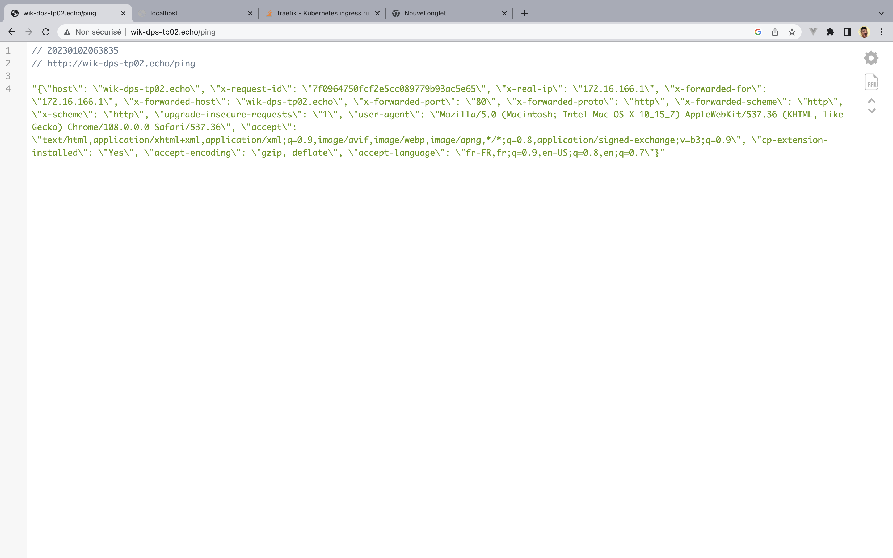

## TP - WIK-DPS-TP04

## V1

Apply the pod
```
kubectl apply -f ./v1.yaml
```

Forward the pod and access it at localhost:8080
```
kubectl port-forward echo-app-gppgl 8080:8080
```

  

### V2

Create the pods
 ```
kubectl apply -f ./v2.yaml
```

Create the deployment
 ```
kubectl apply -f ./v3.yaml
```


### V3

Create the service
 ```
kubectl apply -f ./v3.yaml
```

The port on which the service is 8000
 ```
kubectl get svc
NAME         TYPE        CLUSTER-IP      EXTERNAL-IP   PORT(S)    AGE
echo-app     ClusterIP   10.108.88.248   <none>        8000/TCP   9s
kubernetes   ClusterIP   10.96.0.1       <none>        443/TCP    12m
```

Forward the service to a local port in the host and access it at localhost:8080
 ```
 kubectl port-forward service/echo-app 8000:8000
```

###  V4

Enable ingress

 ```
minikube addons enable ingress
```

Apply ingress
 ```
k apply -f ingress.yaml
```

Add the host to your /etc/hosts file to resolve  wik-dps-tp02.echo hostname.
```
172.16.166.6 wik-dps-tp02.echo
```

You can access it at http://wik-dps-tp02.echo/ping

